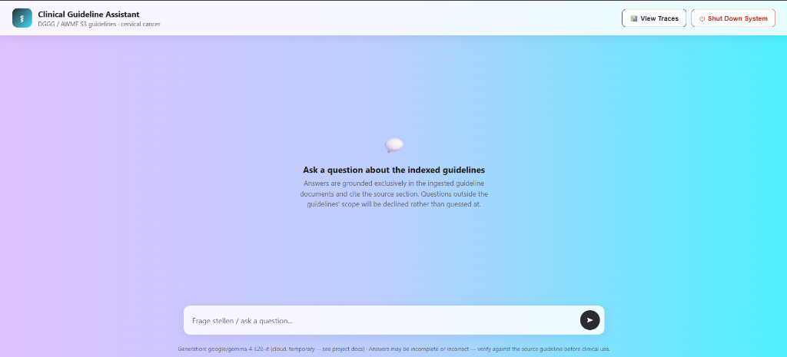

# Clinical RAG — DGGG/AWMF Guideline Assistant

A retrieval-augmented chatbot over German gynecology clinical guidelines (DGGG/AWMF).

## Setup

```bash
python setup.py   # once — installs deps, restores index/data, downloads model weights, asks y/n for Langfuse
python run.py      # every time — starts the chat UI + backend at http://127.0.0.1:8080
```

Requires only **Python 3.10+** — no Ollama, no Docker, no accounts. GPU is auto-detected and used if present, CPU otherwise. Langfuse is optional (`setup.py` prompts; answering "no" disables it everywhere, no reconfiguration needed). 
`setup.py` is safe to re-run (e.g. after `git pull`); `--skip-install` / `--skip-ingest` / `--skip-models` / `--no-langfuse` / `--with-ragas` are available if needed.

## Running the app

```bash
python run.py
```

Starts the chat UI + RAG backend as one process. Requires `setup.py` to have run at least once (warns, but still starts, if the vector index or chunk data is missing). Polls `http://127.0.0.1:8080` until the server responds, including a model warm-up query, which can take a minute the first time, then prints the URL to open in your browser. `Ctrl+C` stops the server. Fast and repeatable: no installs, no downloads, no flags; run it every time you want to use the system after the one-time `setup.py`.

## Benchmarking

```bash
# Local evaluation (default)
python -m evaluation.run_eval

# Cloud evaluation (optional — requires Ollama Cloud models)
python -m evaluation.run_eval_cloud_diagnostic
```

Runs the 12 golden/trap questions and writes `data_corpus/eval_report.csv` (Recall@3/5, answer accuracy, refusal correctness, NDCG@5 — one row per metric with its definition), plus `eval_results.md` and `eval_results_full.json` for detail.

Optionally, running `evaluation.run_eval_cloud_diagnostic` evaluates Phase B using Ollama Cloud models (`gemma4:31b-cloud` as generator and `nemotron-3-super:cloud` as judge) against the same cached retrieval results, writing outputs to `data_corpus/eval_results_cloud.md` and `eval_results_cloud_full.json`.

## Models

| Role | Model | Size |
|---|---|---|
| Dense embedder | `ibm-granite/granite-embedding-278m-multilingual` | 278M |
| Cross-encoder reranker | `cross-encoder/mmarco-mMiniLMv2-L12-H384-v1` | ~110M |
| Dedup embedder (near-duplicate check only) | `intfloat/multilingual-e5-small` | ~118M |
| Generator (default) | `google/gemma-4-E2B-it` | E2B (effective ~2B, multimodal used text-only here) |
| Judge (always transformers, separate from the generator) | `Qwen/Qwen3.5-2B` | 2B |

## UI



## What's shipped vs. regenerated

Only `data_corpus/vector_store/chroma_db.zip`, `data_corpus/processed.zip`, and `data_corpus/pdf/` are committed. `setup.py` restores/rebuilds everything else (vector index, chunk records, BM25 index).

## Adding a new guideline

Drop a new `data_corpus/pdf/<guideline_id>/` folder (PDFs + optional `<guideline_id>.txt` sidecar) in, then re-run:

```bash
python -m ingestion.run_ingest --input data_corpus/pdf/
python -m chunking.build_chunks
```

Both are incremental by default, already-ingested PDFs are tracked by content hash in `data_corpus/processed/ingested_manifest.json` and skipped, so only the new guideline actually gets (re-)parsed and (re-)chunked. The vector index is incremental too: only chunks missing from Chroma get embedded, not the whole corpus. Pass `--force` to `run_ingest`/`build_chunks` to bypass this and reprocess everything.

## Repository layout

- `common/config.py`: every retrieval/chunking hyperparameter (RRF_K, top-k values, thresholds, model names, chunk sizing) in one place, env-var overridable for sweeps/A-B tests
- `ingestion/`: PDF parsing (Docling), AWMF metadata, language ID
- `chunking/`: structure extraction, section/table/recommendation chunking
- `retrieval/`: hybrid dense+BM25 search, guideline/document routing, reranking
- `generation/`: prompts + `llm.py` (transformers, default) / `ollama_llm.py` (Ollama alt.)
- `evaluation/`: golden-12/silver-18 harnesses, LLM-as-judge
- `webapp/`: FastAPI chat UI, Langfuse tracing
